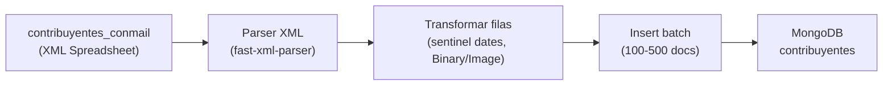

# Collection Contribuyentes + Script de Importación

## Contexto

- **Stack:** Payload CMS 3 + MongoDB ([`src/payload.config.ts`](src/payload.config.ts))
- **Fuente de datos:** [`contribuyentes_conmail`](contribuyentes_conmail) — XML Spreadsheet (Excel) con **~17.398 registros** y **27 columnas**. Ya está en [`.gitignore`](.gitignore) (datos sensibles: emails, CUIT, domicilios).
- **Acceso requerido:** solo lectura en admin, solo rol `ADMIN` (más estricto que collections de Hacienda que usan `isHaciendaOrAdminCollectionAccess`).

## Mapeo de campos (legacy → collection)

Nombres en español, siguiendo convención de [`Matriculados.ts`](src/payload/collections/Matriculados.ts) y [`Ciudadanos.ts`](src/payload/collections/Ciudadanos.ts):

| Campo legacy | Campo Payload                | Tipo       | Notas                                                                                              |
| ------------ | ---------------------------- | ---------- | -------------------------------------------------------------------------------------------------- |
| `num_cont`   | `numero_contribuyente`       | `number`   | **unique + index** — clave de deduplicación en import                                              |
| `nom_cont`   | `nombre`                     | `text`     | `useAsTitle`                                                                                       |
| `dom_cont`   | `domicilio`                  | `text`     |                                                                                                    |
| `pos_cont`   | `codigo_postal`              | `number`   |                                                                                                    |
| `tdo_cont`   | `tipo_documento`             | `number`   | ej. 96 = DNI                                                                                       |
| `ndo_cont`   | `numero_documento`           | `text`     | index para búsquedas futuras                                                                       |
| `cat_cont`   | `categoria`                  | `number`   |                                                                                                    |
| `cui_cont`   | `cuit`                       | `text`     |                                                                                                    |
| `hwe_cont`   | `habilitado_web`             | `checkbox` | 1/0                                                                                                |
| `cwe_cont`   | `clave_web`                  | `text`     | suele venir `(Binary/Image)` → null                                                                |
| `mwe_cont`   | `email`                      | `text`     | campo principal de email; usar `text` (no `email`) para tolerar datos sucios como `...@GMAIL.COM-` |
| `dcc_cont`   | `dcc`                        | `number`   | legacy, sin transformar                                                                            |
| `dca_cont`   | `domicilio_altura`           | `text`     |                                                                                                    |
| `dcs_cont`   | `domicilio_calle_secundaria` | `text`     |                                                                                                    |
| `dct_cont`   | `domicilio_torre`            | `text`     |                                                                                                    |
| `dcp_cont`   | `domicilio_piso`             | `text`     |                                                                                                    |
| `dcd_cont`   | `domicilio_depto`            | `text`     |                                                                                                    |
| `sex_cont`   | `sexo`                       | `number`   |                                                                                                    |
| `nac_cont`   | `nacionalidad`               | `text`     |                                                                                                    |
| `cba_cont`   | `cba`                        | `number`   | legacy                                                                                             |
| `cbu_cont`   | `cbu`                        | `text`     |                                                                                                    |
| `fha_cont`   | `fecha_alta`                 | `date`     | sentinel `9999-12-31` → null                                                                       |
| `fna_cont`   | `fecha_nacimiento`           | `date`     | sentinel `1900-01-01` → null                                                                       |
| `m2w_cont`   | `email_secundario`           | `text`     |                                                                                                    |
| `twe_cont`   | `telefono_web`               | `text`     |                                                                                                    |
| `t2w_cont`   | `telefono_secundario`        | `text`     |                                                                                                    |
| `dfi_cont`   | `dfi`                        | `number`   | legacy                                                                                             |

Todos los campos con `admin.readOnly: true` para reforzar que es data de consulta.

## 1. Nueva collection `Contribuyentes`

**Archivo:** [`src/payload/collections/Contribuyentes.ts`](src/payload/collections/Contribuyentes.ts)

```typescript
access: {
  read: isAdminCollectionAccess,
  create: () => false,
  update: () => false,
  delete: () => false,
},
admin: {
  useAsTitle: 'nombre',
  group: 'Hacienda',
  defaultColumns: ['numero_contribuyente', 'nombre', 'cuit', 'email', 'domicilio'],
  listSearchableFields: ['nombre', 'numero_contribuyente', 'cuit', 'numero_documento', 'email'],
  description: 'Datos de contribuyentes importados del sistema legacy de Rentas',
},
```

Patrón de acceso admin-only read tomado de [`ChatbotConversations.ts`](src/payload/collections/ChatbotConversations.ts) con `isAdminCollectionAccess` de [`src/payload/access/collection.ts`](src/payload/access/collection.ts).

- `create/update/delete: () => false` bloquea mutaciones vía API y admin UI.
- El script de import usa Local API de Payload, que **bypasea access control por defecto** (mismo comportamiento que [`scripts/migrateUsers.ts`](scripts/migrateUsers.ts)).

**Registrar** en [`src/payload.config.ts`](src/payload.config.ts) dentro del array `collections` (junto a otras collections de Hacienda).

**Actualizar** el comentario de matriz de acceso en [`src/payload/access/collection.ts`](src/payload/access/collection.ts) (líneas 128+) documentando Contribuyentes.

**Regenerar tipos:** `pnpm generate:types`

## 2. Script de importación

**Archivo:** [`scripts/importContribuyentes.ts`](scripts/importContribuyentes.ts)

Flujo:



**Parser:** agregar `fast-xml-parser` como `devDependency` — el archivo es SpreadsheetML (~500k líneas), no xlsx binario. `jsdom` existente sería demasiado pesado en memoria.

**Lógica de transformación:**

- `(Binary/Image)`, `-`, strings vacíos → `null`
- Fechas sentinel (`1900-01-01`, `9999-12-31`) → `null`
- `habilitado_web`: `1` → `true`, `0` → `false`
- Emails: `trim()` + `toLowerCase()`, quitar `-` trailing si existe
- Números: parsear con `Number()`, fallback `null` si inválido

**Idempotencia:** antes de insertar, verificar por `numero_contribuyente` (unique). Si existe → skip (log) o update (configurable con flag `--force-update`). Default: skip.

**Rendimiento:** insertar en batches de ~200 con `payload.create` en loop o `payload.db` directo si es necesario. Con ~17k docs, batches de 200 son suficientes (~90 batches).

**Ejecución:**

```bash
npx tsx scripts/importContribuyentes.ts
# opcional: ruta custom
npx tsx scripts/importContribuyentes.ts --file ./contribuyentes_conmail
```

Agregar script en [`package.json`](package.json):

```json
"import:contribuyentes": "cross-env NODE_OPTIONS=--no-deprecation tsx scripts/importContribuyentes.ts"
```

(agregar `tsx` como devDependency si no está disponible)

**Logging:** progreso cada N registros, resumen final (insertados / omitidos / errores).

## 3. Verificación

1. `pnpm generate:types` — sin errores de tipos
2. `pnpm type-check` — compila
3. Correr import contra DB local (`.env` con `DATABASE_URI`)
4. Login en `/admin` con usuario `ADMIN` → ver collection "Contribuyentes" en grupo Hacienda, listar/buscar registros
5. Login con usuario no-admin (ej. `HACIENDA`) → collection no accesible (403 en API, no visible en nav)
6. Confirmar que no hay botón "Create" ni edición de campos

## Archivos a crear/modificar

| Acción        | Archivo                                         |
| ------------- | ----------------------------------------------- |
| Crear         | `src/payload/collections/Contribuyentes.ts`     |
| Crear         | `scripts/importContribuyentes.ts`               |
| Modificar     | `src/payload.config.ts`                         |
| Modificar     | `src/payload/access/collection.ts` (doc matrix) |
| Modificar     | `package.json` (script + devDeps)               |
| Auto-generado | `src/payload-types.ts`                          |

## Fuera de alcance (futuro)

- Vincular contribuyentes con `ciudadanos` por DNI/email
- Acceso para rol `HACIENDA`
- Endpoints públicos o de trámites
- Sincronización continua con sistema legacy
