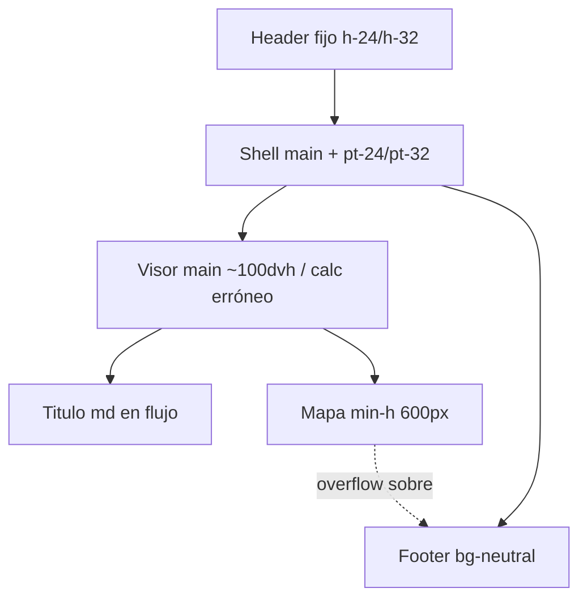

# Fix: mapa solapando el footer en el visor IDE

## Causa

El mapa se dimensiona como si ocupara casi toda la viewport, pero vive **dentro** del shell de [`root-layout.tsx`](src/web/components/root-layout.tsx), que ya suma `pt-24`/`pt-32` por el header fijo y renderiza el footer después.

En [`visor/page.tsx`](<src/app/(web)/transparencia/ide/visor/page.tsx>):

```7:7:src/app/(web)/transparencia/ide/visor/page.tsx
<main className="flex h-[100dvh] flex-col md:container md:mx-auto md:h-[calc(100vh-80px)] md:min-h-[600px] md:px-4 md:py-6">
```

Problemas concretos:

- `h-[100dvh]` / `calc(100vh-80px)` **no restan** el padding del shell (`pt-24`/`pt-32`) ni el bloque de título en `md`.
- `md:min-h-[600px]` en la página, más `md:min-h-[600px]` en [`ide-map-loader.tsx`](src/web/components/ide/ide-map-loader.tsx) e [`ide-map.tsx`](src/web/components/ide/ide-map.tsx), **fuerzan** que el mapa sea más alto que el espacio flex disponible en laptops → overflow visible encima del footer.



## Enfoque

Mantener el footer visible (flujo normal del sitio). El mapa debe **llenar el espacio restante** entre header y el final del área de contenido, sin `min-height` que lo haga desbordar.

## Cambios

### 1. [`src/app/(web)/transparencia/ide/visor/page.tsx`](<src/app/(web)/transparencia/ide/visor/page.tsx>)

- Reemplazar la altura fija incorrecta por una que reste el offset del header del shell:
  - Mobile: `h-[calc(100dvh-8rem)]` (equivale a `pt-32`)
  - `md+`: `md:h-[calc(100dvh-6rem)]` cuando el header scrolled es `h-24`/`pt-24`, o usar `8rem` de forma consistente (el estado no-scrolled es el peor caso)
- Quitar `md:min-h-[600px]` del `<main>` de la página.
- Asegurar columna flex: `flex flex-col min-h-0 overflow-hidden` para que el hijo `flex-1` pueda encogerse.
- Mantener título + `IdeMapLoader className="flex-1 min-h-0"`.

Altura concreta propuesta:

```tsx
<main className="flex h-[calc(100dvh-8rem)] min-h-0 flex-col overflow-hidden md:container md:mx-auto md:px-4 md:py-6">
```

`8rem` = `pt-32` del shell (header expandido). Así el bloque del visor termina donde empieza el borde inferior de la viewport; el footer queda debajo al hacer scroll, sin solaparse.

### 2. [`src/web/components/ide/ide-map-loader.tsx`](src/web/components/ide/ide-map-loader.tsx) y [`src/web/components/ide/ide-map.tsx`](src/web/components/ide/ide-map.tsx)

- Quitar `md:min-h-[600px]` (y bajar/ajustar `min-h-[400px]` si también empuja overflow en móviles bajos).
- Dejar `h-full min-h-0` (o un `min-h` bajo solo en el skeleton de carga) para que el mapa respete el alto del padre flex.

### 3. Verificación manual

- Laptop / viewport ~900–1100px de alto: el mapa no debe tapar el footer verde.
- Mobile: mapa usable a pantalla completa bajo el header, sin overflow sobre el footer.
- `md+`: título + descripción visibles; el mapa ocupa el resto sin forzar scroll interno raro ni sombra encima del footer.
