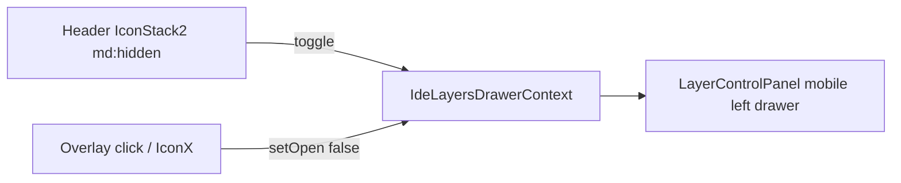

# IDE: capas en header mobile + mapa fullscreen

## Enfoque

Context React compartido entre header y mapa: el botón en el header solo controla abrir/cerrar; el panel de capas sigue viviendo en `IdeMap` (donde está el estado). En mobile el panel pasa de bottom-sheet a drawer izquierdo. Desktop no cambia.

El botón de capas se muestra **solo en** `/transparencia/ide/visor` (vía `usePathname`), porque el resto de rutas bajo `(ide)` no tienen mapa.

## Layout y altura sin scroll

En [`src/app/(ide)/layout.tsx`](<src/app/(ide)/layout.tsx>):

- Quitar el scaffolding incompleto de daisyUI drawer (`drawer` / `drawer-toggle`) — no se usa aún y confunde con el nuevo drawer de capas.
- Estructura:

```tsx
<body className="h-dvh overflow-hidden">
  <IdeShell>{children}</IdeShell>
</body>
```

- `IdeShell` (client): `flex h-dvh flex-col overflow-hidden` + provider del context + header + `<div className="min-h-0 flex-1 overflow-hidden">{children}</div>`.

En [`src/app/(ide)/transparencia/ide/visor/page.tsx`](<src/app/(ide)/transparencia/ide/visor/page.tsx>):

- Reemplazar `h-[65dvh]` / `calc(100dvh-8rem)` por `h-full overflow-hidden` (sin `<main>` anidado).
- El mapa llena el contenedor flex restante bajo el `h-16`.

## Header mobile: logo | título | capas

Nuevo componente client, p.ej. [`src/web/components/ide/ide-shell.tsx`](src/web/components/ide/ide-shell.tsx):

- Header `h-16`: logo + título con `truncate flex-1` (queda “Infra…”) + botón `IconStack2` a la derecha.
- Botón: `md:hidden`, solo si pathname es el visor; toggle del context; `aria-expanded` / título “Capas”.
- Desktop: sin botón de capas en el header (el panel flotante actual permanece).

## Context de capas

Nuevo [`src/web/components/ide/ide-layers-drawer-context.tsx`](src/web/components/ide/ide-layers-drawer-context.tsx):

- `{ open, setOpen, toggle }`
- [`ide-map.tsx`](src/web/components/ide/ide-map.tsx) deja de usar `mobileLayersOpen` local y usa este context para `LayerControlPanel` / sincronización con leyenda.

## Drawer izquierdo (solo mobile)

En [`layer-control-panel.tsx`](src/web/components/ide/layer-control-panel.tsx), mobile:

- De bottom sheet (`bottom-0 … rounded-t-2xl max-h-[70vh]`) a panel izquierdo: ancho ~`w-[min(20rem,85vw)]`, `inset-y-0 left-0`, slide in/out, `h-full`.
- Mantener backdrop (`bg-black/30`) que llama `onOpenChange(false)` — cierre al tocar afuera.
- Mantener `IconX` en el header del panel como cierre explícito.
- Quitar drag handle horizontal (era de bottom sheet).
- Desktop: mismas clases `md:` actuales (panel colapsable izquierdo).

## Controles flotantes

En [`map-floating-controls.tsx`](src/web/components/ide/map-floating-controls.tsx):

- Eliminar el botón de capas (`IconStack2`) — ya no hace falta en mobile.
- Dejar el de leyenda y el resto como están.
- Ajustar `top-20` → algo como `top-3` en mobile, ya que el header ya no es fixed encima del mapa.

## Flujo


