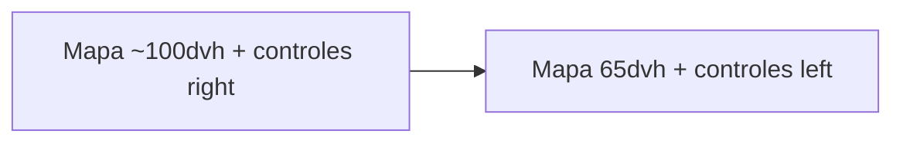

# UX móvil del visor IDE

## Problemas

1. El mapa ocupa casi toda la viewport (`h-[calc(100dvh-8rem)]` + `overflow-hidden`), así que el touch cae en Leaflet y no se puede scrollear la página.
2. Los controles del mapa están a la derecha y se solapan con el tab de accesibilidad (también a la derecha).

## Enfoque (KISS)

Solo dos cambios de layout en móvil; desktop sin cambios de comportamiento.



### 1. Achicar el mapa en móvil — [`visor/page.tsx`](<src/app/(web)/transparencia/ide/visor/page.tsx>)

Hoy:

```tsx
<main className="flex h-[calc(100dvh-8rem)] min-h-0 flex-col overflow-hidden md:container ...">
```

Cambiar a:

- Mobile: `h-[65dvh]` (sin `overflow-hidden`, para que el footer quede debajo en flujo normal y haya zona scrolleable).
- `md+`: mantener altura usable del viewport restando el offset del header, p.ej. `md:h-[calc(100dvh-8rem)] md:overflow-hidden`, más el container/padding actuales.

Resultado: en móvil el mapa deja ~35% de pantalla (más el footer debajo) como área para scrollear sin pelear con Leaflet.

### 2. Controles a la izquierda — [`map-floating-controls.tsx`](src/web/components/ide/map-floating-controls.tsx)

Hoy: `absolute right-3 top-20 ... md:right-6 md:top-6`

Cambiar a: `absolute left-3 top-20 ... md:left-6 md:top-6`

- El botón “volver” ya está arriba a la izquierda (`top-0`); `top-20` debería dejar holgura.
- Libera el borde derecho para el tab/panel de accesibilidad.
- Desktop también a la izquierda (evita choque con el panel de accesibilidad fijo a la derecha).

## Fuera de alcance

- No tocar Leaflet touch/scroll internals.
- No mover Beni ni el widget de accesibilidad.
- No rediseñar paneles de capas/leyenda.

## Verificación manual

- Móvil: mapa ~65% alto; se puede scrollear tocando debajo del mapa hacia el footer.
- Móvil: controles a la izquierda; tab de accesibilidad usable sin solaparse; al expandir el menú no tapa zoom/capas.
- Desktop: mapa sigue llenando el área del visor; controles a la izquierda sin romper paneles.
